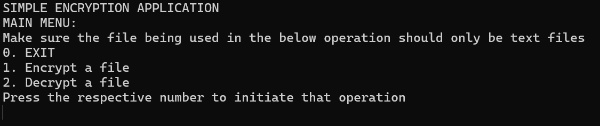
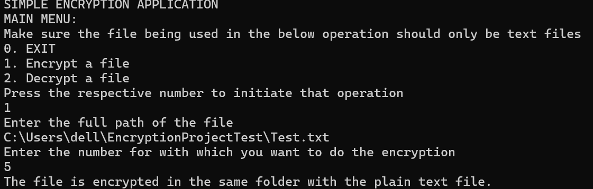
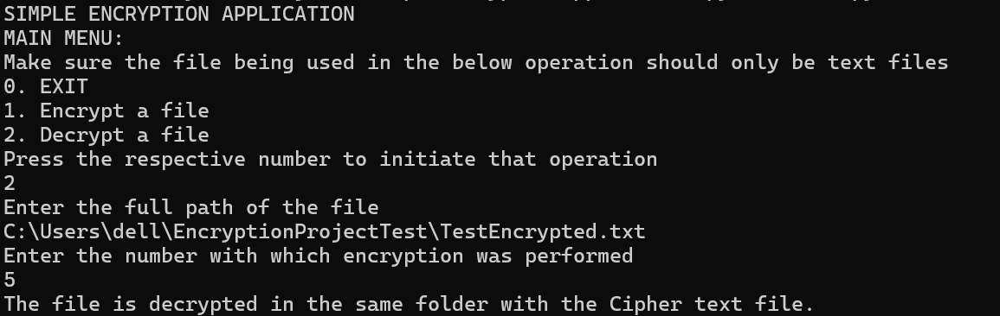
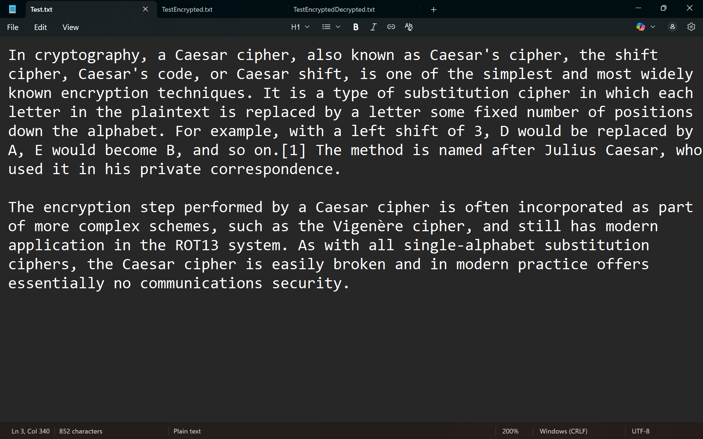
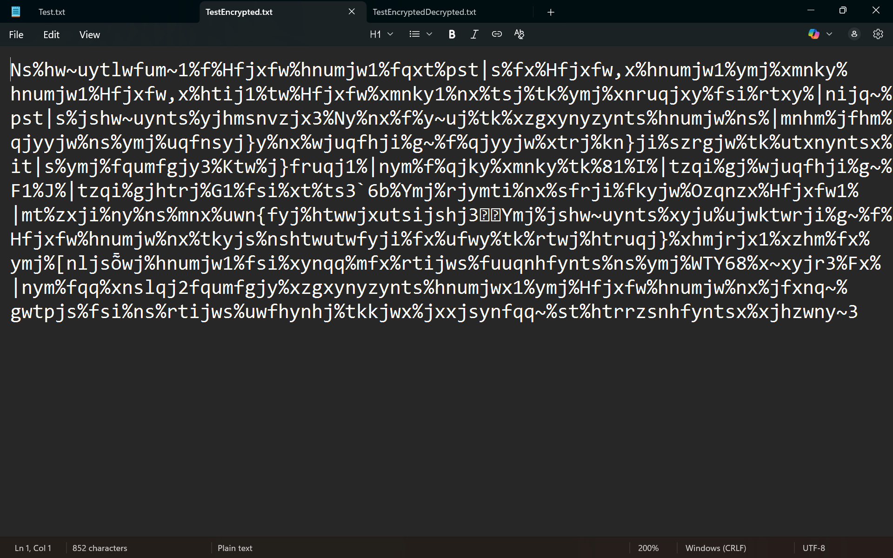
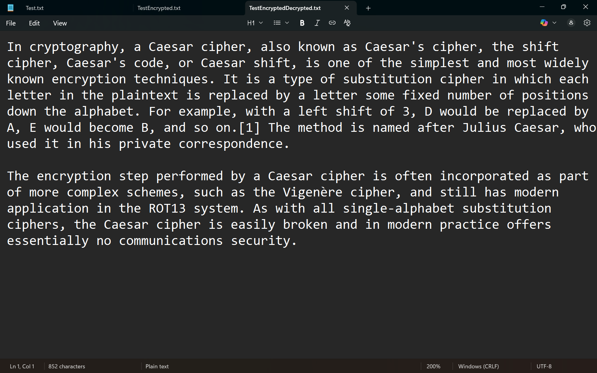

# ENCRYPTION PROJECT BASED ON CAESAR CIPHER ALGORITHM

## What is a Caesar cipher algorithm?

The **Caesar cipher** is one of the simplest and oldest encryption algorithms, attributed to Julius Caesar, who reportedly used it to protect military messages.

**How it works:**

- It’s a **substitution cipher** — each letter in the plaintext is replaced by another letter a fixed number of positions down the alphabet.
- The number of positions you shift by is called the **key** (or shift value).
- Example with a shift of 3:
  - Plaintext: HELLO
  - Shift each letter 3 positions forward:
    - H → K
    - E → H
    - L → O
    - L → O
    - O → R
  - Ciphertext: KHOOR

## What this project does?

This project is a simple Python CLI program that encrypts or decrypts a text file using the Caesar cipher algorithm.

You provide:
- The path to a **text \(.txt\)** file
- A shift number

The program creates an encrypted or decrypted file in the same folder as your original file.

## Features

- Encrypt a **text \(.txt\)** file
- Decrypt an encrypted **text \(.txt\)** file
- Works on any operating system with Python 3 installed

## Requirements

Requires Python 3.10 or above installed  
To download python if you do not have it installed, you can download on the link <https://www.python.org/downloads/>

## How to Download

1. Go to the repository page on GitHub.
2. Click the green **Code** button.
3. Select **Download ZIP**.
4. Extract the ZIP file to any folder on your computer.

## Steps to run the program on your system

> [!NOTE]
> Make sure to prepare the text file on which you want to do the operation prior to running the program

1. Open Terminal/Command prompt on your device.
2. Navigate to the folder in which the project files are stored with the help of cd command. 

   Example:

For windows:
```
cd C:\path\to\project\folder
```

For linux: 
```
cd path/to/project/folder (For Linux/Mac)
```

3. Run the following command:

```
C:\path\to\project\folder> python Main.py
```

You will see the project command line menu from where you can navigate to do the encryption and decryption processes of .txt files only

## Working of the project

Main menu of the program



Encrypting a text file



Decrypting the file



## Results

Before Encryption



After Encryption



After Decryption



## File Structure

CaesarEncryption.py (Encryption logic)

CaesarDecryption.py (Decryption logic)

PathConversion.py (Converts Windows paths to code-friendly format)

Main.py (CLI menu)

## Notes

- Only works with **text \(.txt\)** files.
- Make sure your file is not open in another program while running encryption/decryption.
- Remember to enter the **full path** to the file (e.g., C:\\path\\to\\file.txt).
